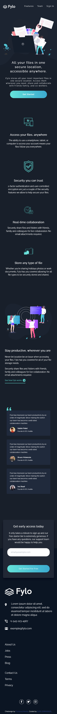
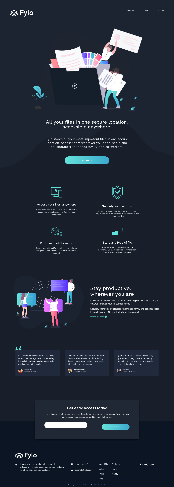

# Frontend Mentor - Fylo dark theme landing page solution

This is a solution to the [Fylo dark theme landing page challenge on Frontend Mentor](https://www.frontendmentor.io/challenges/fylo-dark-theme-landing-page-5ca5f2d21e82137ec91a50fd).
## Table of contents

- [Overview](#overview)
  - [Screenshot](#screenshot)
  - [Links](#links)
- [My process](#my-process)
  - [Built with](#built-with)
  - [What I learned](#what-i-learned)
  - [Continued development](#continued-development)
  - [Useful resources](#useful-resources)
- [Author](#author)
- [Acknowledgments](#acknowledgments)

## Overview
 
### Screenshot

### Links

- Solution URL: (https://github.com/suruaino/Challenge9.git)
- Live Site URL: (https://suru-fylo.netlify.app/)

## My process

### Built with

- Semantic HTML5 markup
- CSS custom properties
- Flexbox
- CSS Grid
- Mobile-first workflow
- Tailwindcss

### What I learned

I improved my skills with css flex property and the use of tailwindcss. 

### Continued development

I will want to learn and know more about accessibilty.

### Useful resources

- [Google](https://www.google.com) - Always my first option before requesting help from anybody. Its a good resource any coder.
- [Tailwind doc](https://www.tailwindcss/docs.com) - It is my most used resource. I only used others when a concept is confusing.

## Author

- SURU EMMANUEL
- Frontend Mentor - [@suruaino](https://www.frontendmentor.io/profile/suruaino)
- Twitter - [@suruaino](https://www.twitter.com/suruaino)

## Acknowledgments

I will want to use this opportunity to thank my lovely sister Ojeifo Loveth and her husband Obende Daniel for their support and encouragement. They kept pushing me right from the day I started this journey till date. They never got tired. I want to say that I really appreciate.

